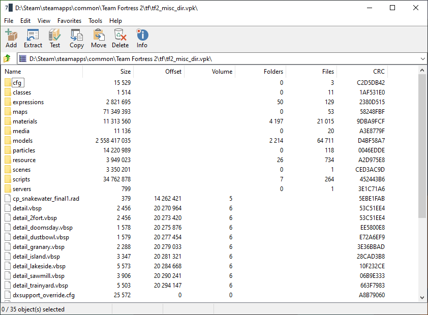
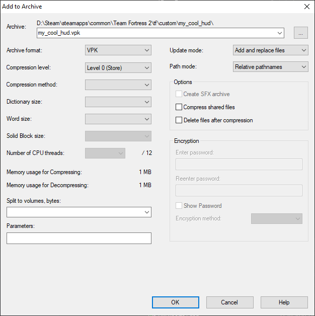
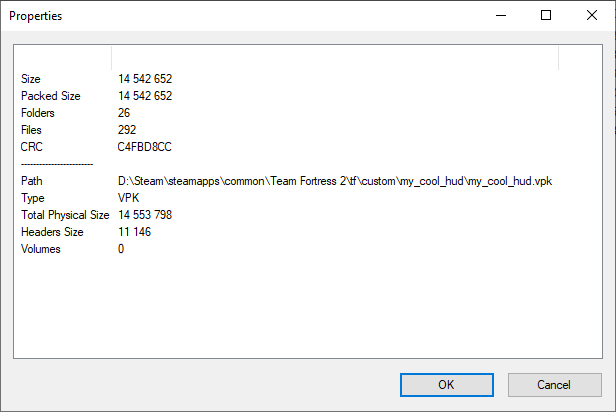

# VPK format provider for 7-Zip
Provides ability for 7-Zip to fully read V1 and V2, and write (with some limitations) V2 VPK files
 
## Limitations
Creation of VPK files is limited to single VPK mode, because of 7-Zip's own multi-pack handling.

 

## Screenshots

